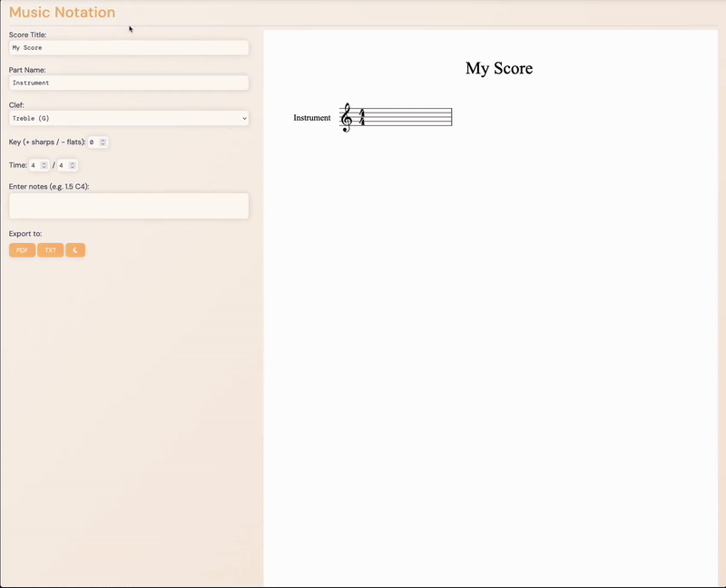

# Music Notation Web App

This project is a web-based tool for creating, rendering, and exporting sheet music.  
It uses [OpenSheetMusicDisplay](https://github.com/opensheetmusicdisplay/opensheetmusicdisplay) to render MusicXML notation directly in the browser.

## Features

- Enter notes, rests, dynamics, clef, key signature, and time signature
- Render sheet music directly in the browser using OSMD
- Dark/Light mode toggle
- Export scores to:
  - PDF (letter size, 8.5 × 11 inches)
  - Plain text

## Example Input

Notes are entered into a text area in the format: `duration pitch`

Examples:
```
0.25 G5
0.25 A5
1 rest
2 F#4
```

- **Durations** are given in beats (e.g., `1` = quarter note in 4/4, `0.5` = eighth note).
- **Pitches** use octave pitch notation (e.g., `C4`, `Bb3`, `F#5`).
- Use `rest` for a rest.

## Demo

Try it out [here](https://michaelyodev.github.io/musicProject).

Here’s an example:

